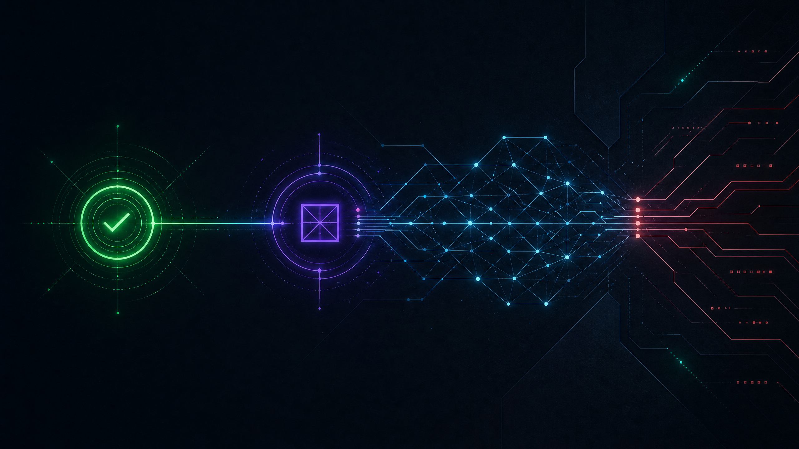
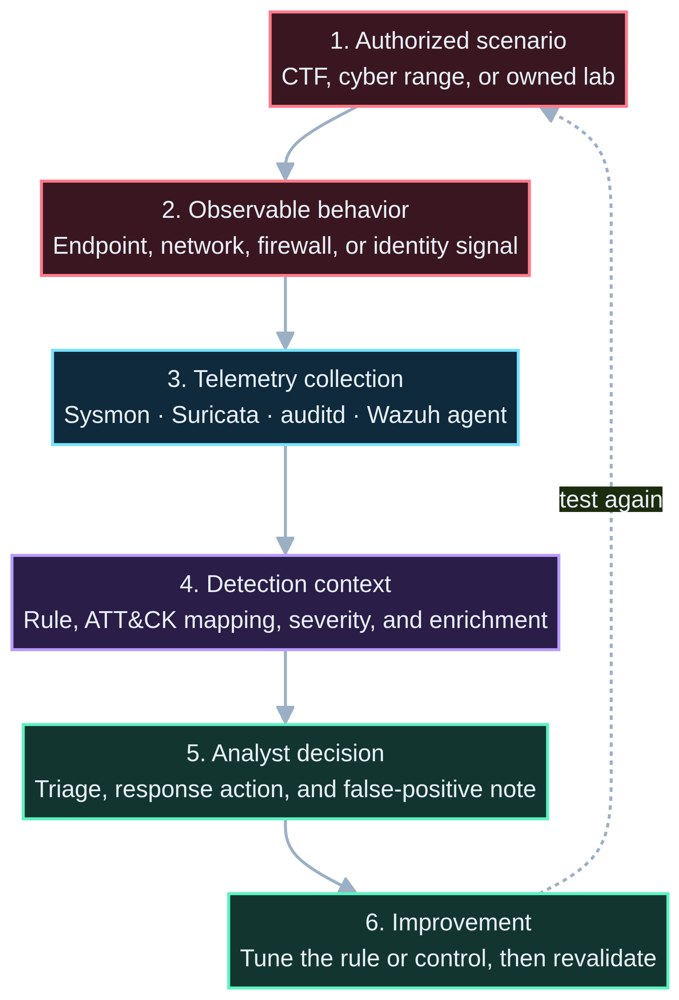

[](docs/detections.md)

# home-lab-siem

**Detection engineering · Wazuh · Suricata · Sysmon · MITRE ATT&CK · authorized attack validation**

A reproducible SOC-grade lab where defensive telemetry is built, controlled adversary behavior is emulated, detections are validated, and the response path is improved through repeatable evidence.

> **Portfolio showcase:** This repository documents the architecture, selected configurations, detection logic, validation approach, and screenshots for a private personal lab. It intentionally excludes secrets, personal environment details, and material that should not be public.

[Detection dossier](docs/detections.md) · [Hardening notes](docs/HARDENING.md) · [Security policy](SECURITY.md) · [Contributing](CONTRIBUTING.md)

---

## The validation loop

| 1 · Instrument | 2 · Emulate | 3 · Detect | 4 · Triage | 5 · Improve |
|:--|:--|:--|:--|:--|
| Collect host, network, and firewall telemetry. | Exercise controlled, authorized techniques in the lab. | Map observations to detection logic and ATT&CK context. | Explain impact, false positives, and the next analyst action. | Tune the rule or control, then run the test again. |

The project is not a dashboard demonstration. It is a working learning environment for answering a concrete defensive question: **can the telemetry, rule, and triage process detect a realistic authorized behavior with useful context?**

### Detection-validation schema



The diagram is the project’s operating model. It begins with an authorized scenario, requires observable evidence, and ends only after the detection or control has been improved and tested again.

---

## Lab architecture

```text
Linux / auditd ─┐
Windows / Sysmon ├─> Wazuh agent ─> Wazuh manager ─> Indexer + dashboard
FortiGate logs ─┤          │
Suricata EVE ───┘          └─> custom decoders, rules, MITRE mapping, active-response design
```

| Layer | Public evidence |
|:--|:--|
| Endpoint telemetry | Wazuh agent configuration, Linux auditd context, and Windows Sysmon documentation. |
| Network visibility | Suricata EVE JSON configuration and network-detection context. |
| Detection logic | MITRE-mapped custom rules, sample logs, and triage notes. |
| Threat intelligence | Integration design notes for MISP, VirusTotal, and perimeter devices. |
| Validation | Controlled atomic-test walkthrough and documented attack-to-detection scenarios. |

---

## Detection evidence

Every included rule is mapped to a relevant ATT&CK technique and should be read together with its log source, expected outcome, and triage context in the [detection dossier](docs/detections.md).

| Rule ID | Defensive question | ATT&CK context |
|---:|:--|:--|
| `100100` | Can repeated SSH authentication failures be detected as a brute-force pattern? | `T1110.001` |
| `100101` | Can suspicious PowerShell behavior be distinguished for investigation? | `T1059.001` |
| `100102` | Can a concentrated network scan be identified from Suricata evidence? | `T1046` |
| `100103` | Can sensitive operating-system paths be monitored for integrity violations? | `T1565.001` |
| `100104` | Can a probable web-shell upload be surfaced for rapid investigation? | `T1505.003` |

> **Validation principle:** A detection is not complete because it exists in a rule file. It is complete only when it has an observable test path, useful triage guidance, and a documented false-positive story.

---

## Screenshots from the lab

| Entry and posture | ATT&CK and detection context |
|:--:|:--:|
|  |  |
| **Platform modules** | **Rule-management view** |
|  |  |

These visuals are evidence of the lab’s defensive interface; they are not a substitute for the documented detection logic and controlled validation approach.

---

## What is public—and what remains private

| Public showcase material | Private or omitted material |
|:--|:--|
| Architecture, selected configurations, custom detection examples, screenshots, and hardening guidance | Personal addresses, credentials, sensitive dashboards, full environment inventory, and any third-party material |
| Controlled-validation approach and ATT&CK mappings | Operational details that would reduce the safety of the lab or be unsuitable for public release |
| Reproducible design concepts | Any employment or internship-confidential implementation details |

---

## Explore the repository

| Resource | Purpose |
|:--|:--|
| [`docs/detections.md`](docs/detections.md) | Detection purpose, sample logs, and triage context. |
| [`docs/HARDENING.md`](docs/HARDENING.md) | Practical security and operational hardening decisions. |
| [`docker-compose.yml`](docker-compose.yml) | Public single-node stack composition and component relationships. |
| [`config/suricata/suricata.yaml`](config/suricata/suricata.yaml) | Network-telemetry configuration context. |
| [`config/wazuh/rules/local_rules.xml`](config/wazuh/rules/local_rules.xml) | The public custom-rule examples. |

---

## Responsible use

> **Responsible use:** All attack-validation work is limited to owned labs, cyber ranges, CTFs, or explicitly authorized environments. The objective is to improve defensive visibility, detections, and incident response—not to target third-party systems.

Security concerns can be reported through the repository’s [security policy](SECURITY.md). Contributions are welcome through the [contribution guide](CONTRIBUTING.md).

---

## Roadmap

- [x] Wazuh, Suricata, and core endpoint telemetry architecture.
- [x] MITRE-mapped detection examples and controlled validation material.
- [ ] Add a compact technique → telemetry → rule → outcome validation matrix.
- [ ] Publish further redacted examples of tuning decisions and false-positive reduction.
- [ ] Add CI checks for rule XML and Markdown/reference quality.
- [ ] Expand controlled endpoint-validation documentation.

## Author

**Yassir Zahidi** — Adversary-informed security builder focused on detection engineering, cyberdeception, DFIR, and authorized security testing.

[Portfolio](https://y-zahidi.github.io) · [LinkedIn](https://www.linkedin.com/in/yassir-zahidi/) · [GitHub](https://github.com/y-zahidi)
