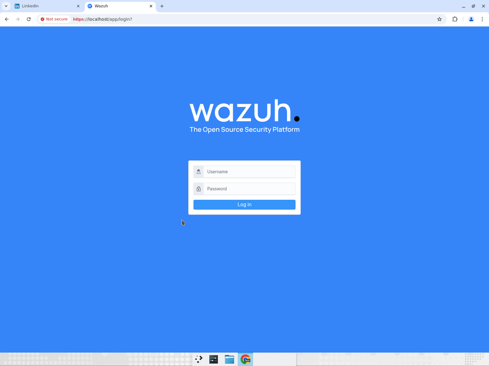
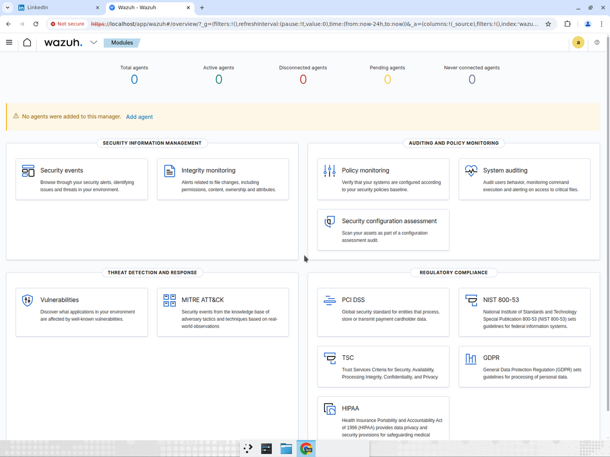
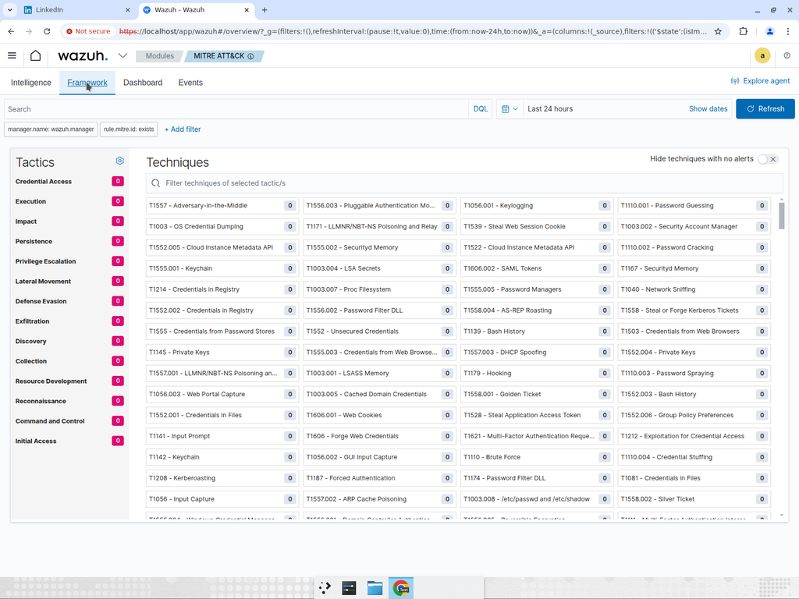
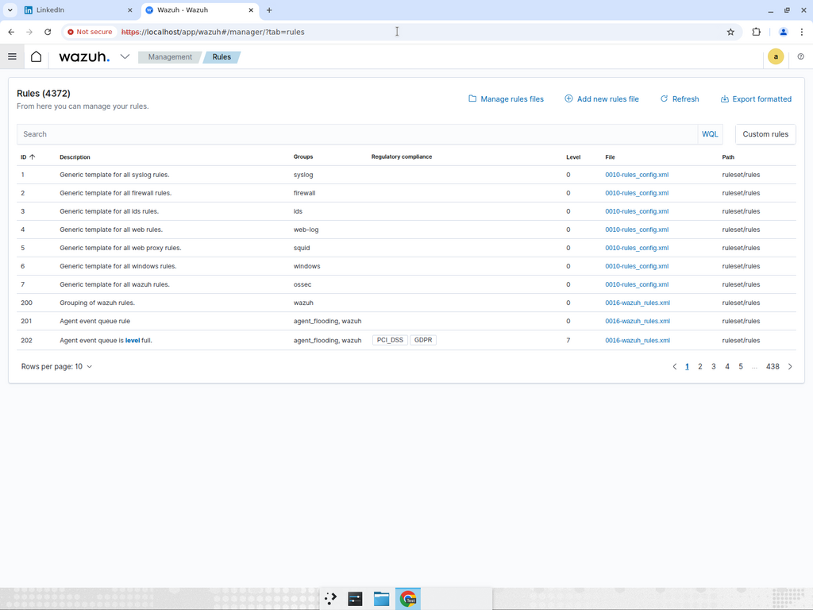
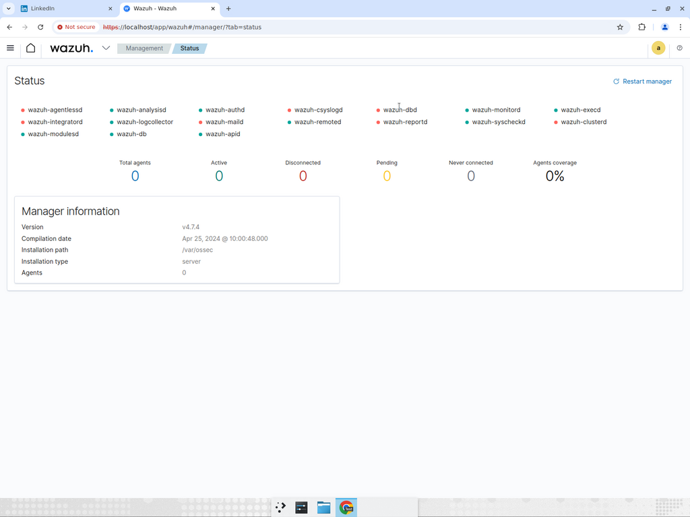
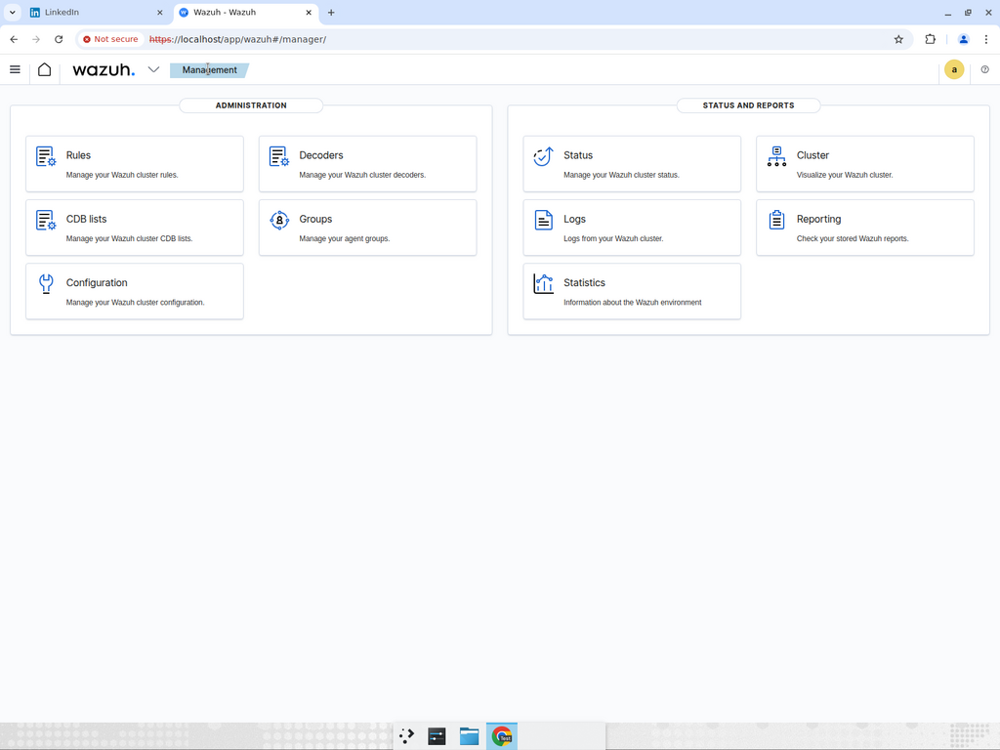

# home-lab-siem

**Design and architecture overview of a reproducible SOC-grade SIEM lab — Wazuh + Suricata + Sysmon + MISP + VirusTotal, integrated with a FortiGate firewall.**


> [!NOTE]
> This repository serves as a showcase of the project design, architecture, and configuration snapshots for portfolio purposes. The full deployment codebase is hosted in a private repository.


## What this is

A working SIEM stack with the same components I used in production at the Préfecture, scoped down to what runs on a single laptop:

- **Wazuh** (manager + indexer + dashboard) — log management, HIDS, file integrity monitoring, MITRE ATT&CK rule tagging.
- **Suricata** — network IDS with EVE JSON output ingested by Wazuh.
- **Sysmon** baseline (SwiftOnSecurity ruleset) for Windows endpoints.
- **Docs** for the integrations I had in production but couldn't bring into the lab cleanly: MISP, VirusTotal, FortiGate, Nessus.

## Architecture

```
┌──────────────────────────────────────┐
│        Endpoints (lab targets)       │
│  Linux + auditd      Windows + Sysmon│
│   wazuh-agent          wazuh-agent   │
└─────────┬─────────────────┬──────────┘
          │                 │
          ▼                 ▼
   ┌──────────────────────────────┐
   │ Suricata (IDS, EVE JSON out) │
   └──────────────┬───────────────┘
                  ▼
   ┌──────────────────────────────┐
   │ Wazuh manager — decoders,    │
   │ rules, active response       │
   └──────────────┬───────────────┘
                  ▼
   ┌──────────────────────────────┐
   │ Wazuh indexer (OpenSearch) + │
   │ Wazuh dashboard              │
   └──────────────────────────────┘
```

## What lives where

```
.
├── docker-compose.yml          single-node stack
├── config/
│   ├── wazuh/
│   │   ├── ossec.conf
│   │   ├── rules/local_rules.xml   ← custom detections (see below)
│   │   └── decoders/
│   └── suricata/
│       └── suricata.yaml
├── scripts/
│   └── generate-certs.sh           one-shot certs for the manager↔indexer chain
├── docs/
│   ├── HARDENING.md
│   ├── MISP_INTEGRATION.md
│   ├── WINDOWS_AGENT.md
│   ├── architecture.md
│   ├── detections.md
│   └── atomic-red-team.md
└── screenshots/                    from a real `docker compose up`
```

## Detections shipped

Every rule is tagged with the MITRE ATT&CK technique it targets. Sample logs and triage steps live in [`docs/detections.md`](docs/detections.md).

| Rule ID | Detection | MITRE |
|---|---|---|
| 100100 | SSH brute-force (5+ failures in 60s) | T1110.001 |
| 100101 | Suspicious PowerShell (encoded, IEX, downloadstring) | T1059.001 |
| 100102 | Port scan from a single source (Suricata-based) | T1046 |
| 100103 | File integrity violation in `/etc` or `C:\Windows\System32` | T1565.001 |
| 100104 | Probable web shell upload | T1505.003 |

The XML for these rules is in [`config/wazuh/rules/local_rules.xml`](config/wazuh/rules/local_rules.xml). They're a starting point, not a SOC ruleset — see "Lessons learned" below.

## Why this stack (and not just ELK)

| Need | Choice | Reason |
|---|---|---|
| Log shipping & parsing | Wazuh agent | Native enrollment, decoders for 100+ apps. |
| HIDS / FIM / Rootcheck | Wazuh manager | Built-in, no extra agent. |
| Network IDS | Suricata | EVE JSON, multi-threaded, ET Open ruleset, easy Wazuh ingest. |
| Search & storage | Wazuh indexer (OpenSearch) | Bundled, Apache 2.0, no Elastic license drama. |
| Endpoint telemetry (Windows) | Sysmon + SwiftOnSecurity | The de-facto baseline. |
| MITRE ATT&CK mapping | Built into Wazuh | Each rule auto-tagged. |

What I cut for the lab:
- **Single-node Wazuh.** Production should be a 3-node indexer cluster.
- **No live MISP container.** MISP integration is documented in [`docs/MISP_INTEGRATION.md`](docs/MISP_INTEGRATION.md); running it adds operational overhead I didn't want in a `docker compose up`.
- **No FortiGate emulation.** Emulating a FortiGate locally needs a paid VM image. The integration patterns I used at the Préfecture are documented but not runnable here.

## Dashboard

Screenshots from a live run on this exact code:

| Login | Modules |
|:--:|:--:|
|  |  |
| **MITRE ATT&CK** | **Rules (4 372 built-in)** |
|  |  |
| **Manager status** | **Administration** |
|  |  |

## Lessons learned

Four things I learned at the Préfecture that this lab tries to bake in:

1. **Tune out the noise on day 1.** Out-of-the-box Wazuh fires hundreds of alerts an hour from `sudo`, `cron`, and `systemd-logind`. The first PR I made on the production repo was a tuning ruleset that filtered ~85% of the volume.
2. **Active Response is a foot-gun.** A typo in an `ip-blacklist` config can lock the SOC analyst out of the manager. Run it audit-only for the first two weeks.
3. **Self-signed certs work — document the rotation.** Wazuh certs are valid 10 years out of the box, but the manager↔indexer chain breaks silently if you reinstall one component. Keep `scripts/generate-certs.sh` checked in.
4. **The dashboard is not a SOC.** A dashboard is a starting point. Real triage happens in tickets — plan the integration with Jira / GLPI / TheHive before go-live.

## Roadmap

- [x] Single-node Wazuh + Suricata + 5 baseline rules.
- [x] Atomic Red Team walkthrough (T1110.001, T1059.001).
- [ ] MISP integration as an opt-in `docker compose --profile misp up`.
- [ ] Active Response examples (audit-mode + production-mode).
- [ ] Windows agent + Sysmon SwiftOnSecurity ruleset bundled.
- [ ] CI lint of Wazuh rule XML on every PR.

## License

MIT — see [LICENSE](LICENSE). Inspired by real production work at the Préfecture de Tétouan; contains no sensitive material from that engagement.

## About me

I'm **Yassir Zahidi**, Computer Engineering student in Rabat with a background in Cybersecurity. Open to a SOC / blue-team / DevSecOps internship for 2026.

